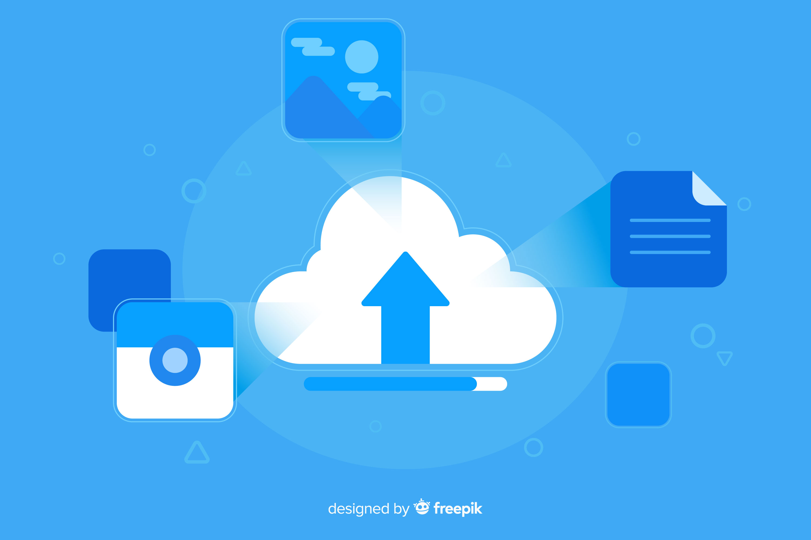

# MiniDrive

<p align="center">
  
</p>

<p align="center">
  <strong>A lightweight, serverless file storage web application built with Django and AWS</strong>
</p>

<p align="center">
  <a href="#features">Features</a> •
  <a href="#architecture">Architecture</a> •
  <a href="#tech-stack">Tech Stack</a> •
  <a href="#setup">Setup</a> •
  <a href="#usage">Usage</a> •
  <a href="#deployment">Deployment</a> •
  <a href="#license">License</a>
</p>

---

## 🌟 Features

- **Modern UI**: Clean, responsive Google Drive-inspired interface
- **Drag & Drop**: Simple file uploading with visual feedback
- **File Preview**: Visual indicators for different file types
- **Serverless Storage**: Leveraging AWS S3 for reliable file storage
- **Scalable Architecture**: Utilizing AWS Lambda for backend processing
- **Secure Access**: Implementation of presigned URLs for secure file access

## 🏗️ Architecture

MiniDrive employs a hybrid architecture that separates concerns:

- **Frontend Layer**: Django web application handles user interface and request routing
- **API Layer**: AWS API Gateway manages API requests and authentication
- **Processing Layer**: AWS Lambda functions process file operations
- **Storage Layer**: AWS S3 buckets store files with presigned URLs for secure access

<p align="center">
  
</p>

## 🛠️ Tech Stack

### Frontend
- HTML5, CSS3, JavaScript
- Django Templates

### Backend
- Python 3.x
- Django 4.2+
- Boto3 (AWS SDK)

### Cloud Services
- AWS Lambda Functions
- AWS API Gateway
- AWS S3
- AWS IAM (for permissions)

## ⚙️ Setup

### Prerequisites

- Python 3.8+
- pip
- Git
- AWS Account (for production deployment)

### Local Development

1. **Clone the repository**
   ```bash
   git clone https://github.com/KARTIKNAIK18/Minidrive.git
   cd minidrive
   ```

2. **Set up a virtual environment**
   ```bash
   python -m venv .venv
   source .venv/bin/activate  # On Windows: .venv\Scripts\activate
   ```

3. **Install dependencies**
   ```bash
   pip install -r requirements..txt
   ```

4. **Configure environment variables**
   - Create a `.env` file in the project root:
     ```
     API_URL=https://szudj39ivk.execute-api.ap-south-1.amazonaws.com/dev/files
     ```

5. **Run migrations**
   ```bash
   python manage.py migrate
   ```

6. **Start the development server**
   ```bash
   python manage.py runserver
   ```
   
7. **Access the application**
   - Open your browser and navigate to `http://127.0.0.1:8000`

## 📝 Usage

### File Upload

1. Navigate to the upload page
2. Drag and drop files or click to browse
3. Select the file you want to upload
4. Click the "Upload" button
5. View the file in your drive

### File Management

- **View Files**: All uploaded files are displayed on the home page
- **Download Files**: Click on a file to download it
- **Delete Files**: (Coming Soon)

## 🚀 Deployment

### Django Web Application

Deploy the Django application on any standard web server like:
- AWS Elastic Beanstalk
- Heroku
- Digital Ocean
- PythonAnywhere

### AWS Components

For the serverless components:
1. Deploy Lambda functions for file processing
2. Configure API Gateway for endpoint management
3. Set up S3 buckets for file storage
4. Configure IAM roles and permissions

## 📈 Future Enhancements

- [ ] User authentication and personal file storage
- [ ] File sharing capabilities
- [ ] Folder organization
- [ ] Search functionality
- [ ] File version control
- [ ] Mobile application integration

## 📜 License

This project is licensed under the MIT License - see the [LICENSE](LICENSE) file for details.

---

<p align="center">
  Developed by <a href="https://github.com/KARTIKNAIK18">KARTIK NAIK</a> with ❤️
</p>